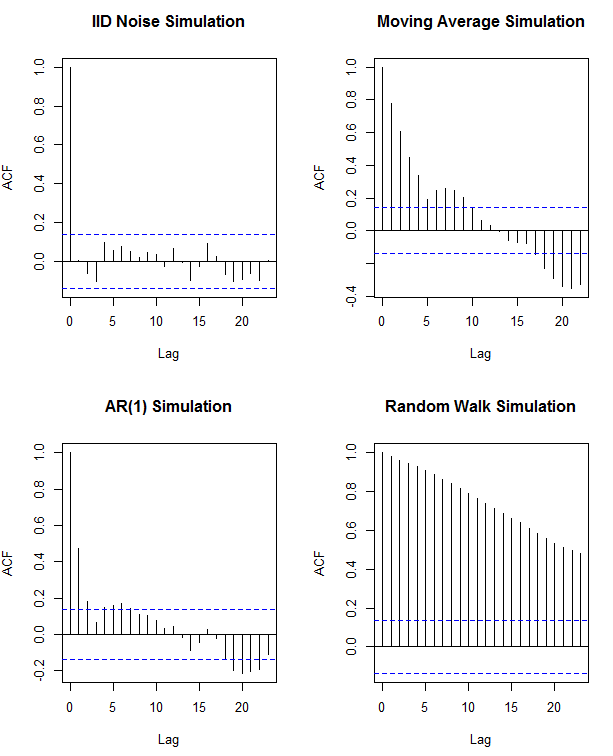

###2.
a) 
The passenger airline data seems non-stationary; there is an upward trend, seasonality and 
increasing spread as time increases.

```{r, echo = FALSE}

par(mfrow = c(1,2))

pax <- read.table("http://www19.homepage.villanova.edu/jesse.frey/Math8444/airline2.txt", 
                  header=FALSE, sep="", na.strings="NA", dec=".", strip.white=TRUE)
names(pax)[1] <- "pax"
pax <- ts(pax)
plot(pax, type = "p")
plot(pax)

```


I tried 6 smoothing techniques which are presented in the figure below. The technique that I think best estimates the deseasonalized trend is the smoothing splines method which is presented below the 6 plots, along with the code used to create it.


```{r, echo = FALSE, warning = FALSE, fig.width = 12, fig.height=12}

library(TTR)

pax <- read.table("http://www19.homepage.villanova.edu/jesse.frey/Math8444/airline2.txt", 
                  header=FALSE, sep="", na.strings="NA", dec=".", strip.white=TRUE)
names(pax)[1] <- "pax"
pax <- ts(pax)

mov.avg4 <-SMA(pax, n=2) #uses TTR package
mov.avg12 <-SMA(pax, n=12)

month1 <- time(pax) - mean(time(pax))
month2 <- month1^2
month3 <- month1^3
cs <- cos(2*pi*month1)
sn <- sin(2*pi*month1)
reg1 <- lm(pax~month1 + month2 + month3, na.action=NULL)
reg2 <- lm(pax~month1 + month2 + month3 + cs + sn, na.action=NULL)


#all 6 plots
par(mfrow=c(2,3))
#moving avg
plot(pax, type="p", main = "moving average")
lines(mov.avg12, col = "red")

#Polynomial and Periodic Regression Smoothers
plot(pax, type="p", ylab="Pax", main = "polynomial")
lines(fitted(reg2), col="red")

#kernel
plot(pax, type="p", ylab="mortality", main="kernel smoothing")
lines(ksmooth(time(pax), pax, "normal", bandwidth=12), col="red")

#lowess & NN
plot(pax, type="p", ylab="pax", main="lowess")
lines(lowess(pax, f=2/3), col = "red")

plot(pax, type="p", ylab="pax", main="nearest neighbor")
lines(supsmu(time(pax), pax, span=.5),col="red")

#smoothing splines
plot(pax, type="p", ylab="pax", main="Smoothing splines")
lines(smooth.spline(time(pax), pax, spar=1), col="red")

```


```{r, echo = TRUE, warning=FALSE, fig.width = 8, fig.height=8}
plot(pax, type="p", ylab="pax", main="Smoothing splines")
lines(smooth.spline(time(pax), pax, spar=1), col="red")

```


I chose this method because the trend line was smooth, indicating no fluctuations from seasonaility effects, and seemed to lie right in the middle of the data and provide a good estimate of trend. The moving average and kernel smoothing lines seemed like they maight still be influenced by some seasonality.


###3. 
The ACF plots for the 4 time series are below.

```{r, echo = FALSE, fig.width = 12, fig.height=12}

series1 <- read.table("http://www19.homepage.villanova.edu/jesse.frey/Math8444/ts1.txt", 
                  header=FALSE, sep="", na.strings="NA",dec=".",  strip.white=TRUE)

series2 <- read.table("http://www19.homepage.villanova.edu/jesse.frey/Math8444/ts2.txt", 
                   header=FALSE, sep="", na.strings="NA", dec=".", strip.white=TRUE)


series3 <- read.table("http://www19.homepage.villanova.edu/jesse.frey/Math8444/ts3.txt", 
               header=FALSE, sep="", na.strings="NA", dec=".", strip.white=TRUE)


series4 <- read.table("http://www19.homepage.villanova.edu/jesse.frey/Math8444/ts4.txt", 
               header=FALSE, sep="", na.strings="NA", dec=".", strip.white=TRUE)

series <- cbind(series1, series2, series3, series4)
names(series)[1] <- "series1"
names(series)[2] <- "series2"
names(series)[3] <- "series3"
names(series)[4] <- "series4"

#ACF plots
par(mfrow=c(2,2))
acf(series$series2, main = "ACF of Series 2")
acf(series$series3, main = "ACF of Series 3")
acf(series$series1, main = "ACF of Series 1")
acf(series$series4, main = "ACF of Series 4")


```

Since it was given that the time series were IID, AR(1), Moving Average or Random Walk, I created a simulation of each type consisting of 200 observations. The ACF plots for the 4 simulated time series are below.



Matching the simulated ACFs to the unknown series ACF's, Series 1 is AR(1), Series 2 is IID, Series 3 is a Moving Average, and Series 4 is a Random Walk.

